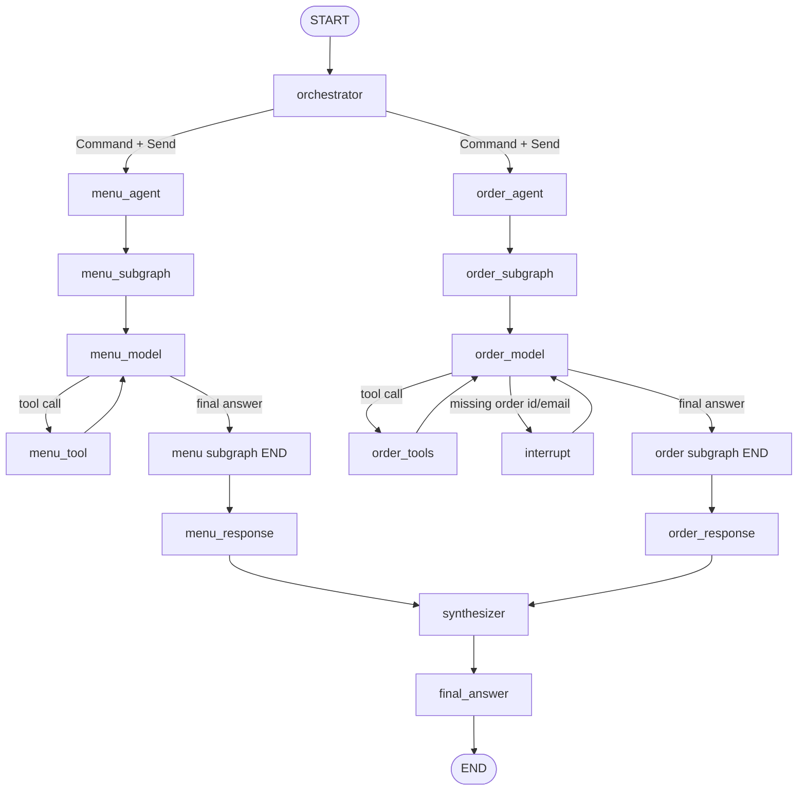
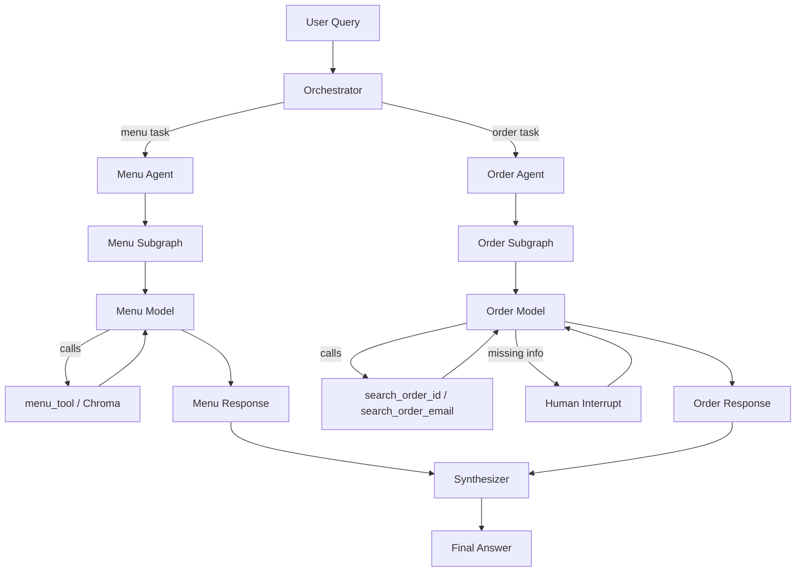

## 1. Overview
You will build SnackStack, a voice-enabled multi-agent food delivery assistant powered by LangGraph. The system accepts user queries (text or voice), routes them through an orchestrator to specialist agents (Menu Agent and Order Agent), and returns a unified response.

This project covers core concepts in modern AI application development: multi-agent orchestration, RAG (Retrieval-Augmented Generation), structured LLM output, tool calling, human-in-the-loop interaction, and voice I/O.

## 2. What You Are Building
A CLI-based assistant for a fictional food delivery platform called SnackStack. The system should:
Accept natural language queries via text input (and optionally voice)
Route queries to the correct specialist agent(s) using an LLM-powered orchestrator
Search a menu catalog using semantic search (RAG with ChromaDB)
Look up order status by Order ID, Tracking ID, or email
Ask the user for missing information when needed (Human-in-the-Loop)
Merge responses from multiple agents into a single friendly reply
Optionally support voice input (Whisper STT) and voice output (OpenAI TTS)

## 3. Architecture Diagram

```text
Voice / Text Input
        |
        v
  +-------------+
  | Orchestrator |  <-- Structured-output routing (Pydantic)
  +------+------+
         |  Send() -- parallel dispatch (optional)
    +----+-----+
    v          v
 +--------+ +--------+
 |  Menu  | | Order  |  <-- Each runs its own tool-calling loop
 | Agent  | | Agent  |
 +---+----+ +---+----+
     |          |
     v          v
   +--------------+
   | Synthesizer  |  <-- Merges responses (optional)
   +------+-------+
          |
          v
   Voice / Text Output
```

## 4. Project Structure

```text
snackstack/
|-- snackstack/           # Python package
|   |-- __init__.py
|   |-- main.py           # CLI entry point
|   |-- config.py         # LLM, embeddings, OpenAI client setup
|   |-- state.py          # Shared StackState (TypedDict)
|   |-- graph.py          # StateGraph builder & compiler
|   |-- subgraph.py       # MenuSubGraphState and OrderSubGraphState
|   |-- logger.py         # Centralized logging
|   |
|   |-- agents/
|   |   |-- __init__.py   # Re-exports node functions
|   |   |-- prompts.py    # System prompts for all nodes
|   |   |-- orchestrator.py
|   |   |-- menu_agent.py
|   |   |-- menu_subagent.py
|   |   |-- order_agent.py
|   |   |-- order_subagent.py
|   |   |-- synthesizer.py  # Optional: merges parallel responses
|   |
|   |-- data/
|   |   |-- __init__.py
|   |   |-- menu.py       # Menu catalog
|   |   |-- orders.py     # Order database
|   |
|   |-- tools/
|   |   |-- __init__.py
|   |   |-- menu_tools.py # search_menu_catalog
|   |   |-- order_tools.py# get_order_status
|   |
|   |-- voice/            # Optional
|       |-- __init__.py
|       |-- recorder.py   # Whisper STT
|       |-- speaker.py    # OpenAI TTS
|
|-- pyproject.toml
|-- .env.example
|-- .gitignore
|-- README.md

```

## Architecture Diagram



## 6. Flow Diagram



